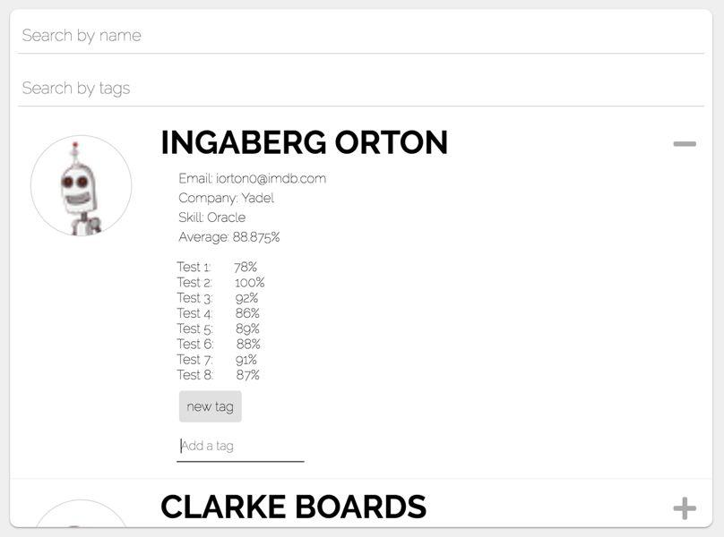

# Purpose of this project

Implement the following front-end of the website screenshot for a technical challenge.

This is on a public repository so I have removed all references to the company and I have replaced all of the company's APIs.

# Tech Used

- React
- SCSS

# `npm start`

Runs the app in the development mode. 
Open [http://localhost:3000](http://localhost:3000) to view it in the browser.
